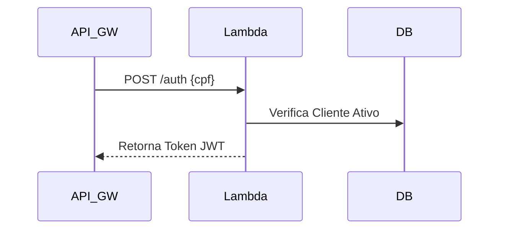

# Serverless Function: Autenticacao via CPF

## Descricao do Proposito
Este servico Serverless e acionado pelo API Gateway para validar o CPF dos clientes no banco de dados e emitir o token de autorizacao JWT. Retira a carga de processamento de login da aplicacao principal.

## Tecnologias Utilizadas
- AWS Lambda
- AWS API Gateway
- Node.js / Python (conforme runtime escolhido)

## Passos para Execucao e Deploy
Pipeline CI/CD empacota o codigo e faz o deploy na AWS.
Para testes locais, utilizar ferramentas como Serverless Offline.

## Diagrama da Arquitetura Especifica

